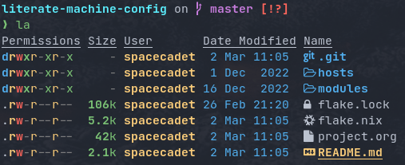

This is my set of dotfiles in a single flake. The README contains a high-level description of the outputs and the `project.org` file contains the details and rationalization of implementation.

# Background

I have migrated to using Nix(ideally, NixOS) on all machines that I get my hands on. This repo contains the configurations for the common tools I use across the machines.

Certain components of my config (mostly dealing with passwords and such) are not included in this flake but rather managed through a separate flake called ~private-config~

# Usage

```nix
{
    inputs= {
        monorepo = {
            url = "github:VTimofeenko/monorepo-machine-config";
            inputs = {
                infra.follows = "stub-flake";
                private-config.follows = "stub-flake";
            };
        };
        stub-flake.url = "github:VTimofeenko/stub-flake"; # A completely empty flake
    };
    outputs = inputs@{ ... }:
    {
        # Import modules/overlays from inputs.monorepo. See the rest of README for more details
    };
}
```

### ZSH module

#### Usage

To use this module separately from `default` one:

```nix
{
    outputs = inputs@{ ... }:
    {
        nixosConfigurations.machine-name = nixpkgs.lib.nixosSystem {
            # ...
            modules =
            [
                inputs.monorepo.nixosModules.zsh
            ];
        };
    };
}
```

and set the users' shells to zsh.

#### Screenshot

A screenshot showing open shell in the root of this project:



#### High-level features description

1. Uses [starship](https://starship.rs/) to set up the prompt
2. Highlights syntax in command line
3. Automatically suggests command from history
4. Shares history between currently running sessions
5. (optionally) uses gpg-agent for ssh authentication
6. Sets up [direnv](https://direnv.net/). ~.direnv~ can immediately create a Nix developemnt shell from a local flake.nix if it contains ~use flake~.
7. Allows editing the current command in $EDITOR by hitting ESC and E: [01-vim-edit](./modules/zsh/plugins/01-vim-edit.zsh)
8. Sets up simple way to change directory through stack of last visited dirs (`cd +1`, `+2`, `+3`, ...): [02-cd](./modules/zsh/plugins/02-cd.zsh)
9. Creates a mechanism to use bookmarks by using double @ symbol: bookmarks: [bookmarks](./modules/zsh/plugins/bookmarks.zsh)
10. Depending on the mode (typing vs editing in vim), shape of the cursor changes: [cursor_mode](./modules/zsh/plugins/cursor_mode.zsh)
11. When entering `nix shell` -- zsh is preserved as the shell

### Nix module

The tweaks I use for nix the package manager:

- Enable flakes (mandatory)
- Quickly fail if the network is inaccessible
- Do not nag me if a flake git repo is dirty (has some uncommitted stuff)
- Automatically optimizes `/nix/store` to save a bit of space using hardlinking

#### Installation

To use this module separately from `default` one:

```nix
{
    outputs = inputs@{ ... }:
    {
        nixosConfigurations.machine-name = nixpkgs.lib.nixosSystem {
            # ...
            modules =
            [
                inputs.monorepo.nixosModules.nix-config
            ];
        };
    };
}
```
